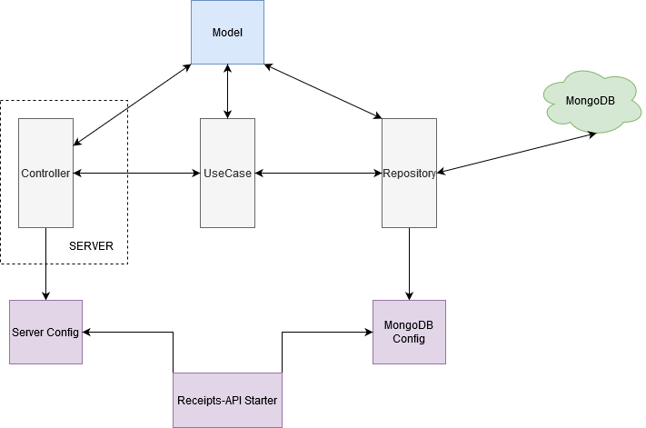

# recipes-api
Study project using Golang + fasthttp + MongoDB driver.

****

### Project

recipes-api is an rest api to store receipt links along with some notes. 

The purpouse is to keep Golang codding skills and improve and/or test some concepts.

### Tech Stack

* [Golang](https://golang.org/)
* [Mongo Go Driver](https://github.com/mongodb/mongo-go-driver)
* [FastHttp](https://github.com/valyala/fasthttp)

### Running this project

You can run recipes-api using 3 differents way. 
The following steps will guide you through the 3 ways to run it :)

### 1- Running

You can run this api project navigating to cmd folder and running build and run. When executing run command you can pass a third argument as dev, qa or prod indicating the environment you want to execute. When no arg is passing it will assume dev.

##### Navigate to cmd folder
``
cd cmd
``

##### build
``
go build
``

##### run without argument will assume dev envirnment
``
go run main.go
``

##### run with one of those arguments on list
``
go run  main.go [dev, qa, prod]
``

You can check the environment configurations on fodler
configs/files/mongodb and configs/files/server  by its indication on config.mongodb.<env>.json. Exampels:
* config.mongodb.dev.json
* config.server.dev.json

### 2 - Running Docker manually

The second way to run this app is by running manually all the steps using docker files to get it up and runnign.

First, you should Create a docker image from this project by running

``
docker build -t recipes-api .
``

then pull mongodb

``
docker pull mongo:latest
``

Now we should have a volume

``
docker volume create --name=mongodata
``

Run MongoDb on detached mode using the volume with the name mongodb

``
docker run --name mongodb -v mongodata:/data/db  -p 27017:27017-d mongo
``

Once we get it up lets run the app  using name as dev-recipes-api passing the mongodb connection as parameter using port 8087 and run it on detached mode.

``

docker run -d --name dev-recipes-api -e MONGO_URL=mongodb://172.17.0.2:27017/?readPreference=primary&appname=MongoDB%20Compass%20Community&ssl=false -p 8087:8061 recipes-api

``
### 3 - Running PowerShell script

This is my fav :) 

the run-dev.ps1 file on root folder contains all the steps needed to put recipes-api up and running. 

So, you cann run it by simply  executing:

``
.\run-dev.ps1
``

Now you know all the ways to put it running, just try :)

Check the API status  calling the api :

localhost:<port>/ping

### Architecture

This project is organized in 3 layers.
1. Controller (api)

contains API level executions, such as capturing parameters, parsing body to models and responsing api executions setting http status and messages.

2. Use Case 

Executes the business rules, such as validations.

3. Repository

Execute commands on MongoDB

#### Structure overview

#### Folders

* api : Register controllers

* cmd : Main application

* configs : Configuration files and procedures
* handlers : Prepare Server 
* internals : Business side information
* _documentation : support for readme files

### Future developments 

* Adding GRPC
    * For a log project

#### Good links
* [Project Layout](https://github.com/golang-standards/project-layout)

